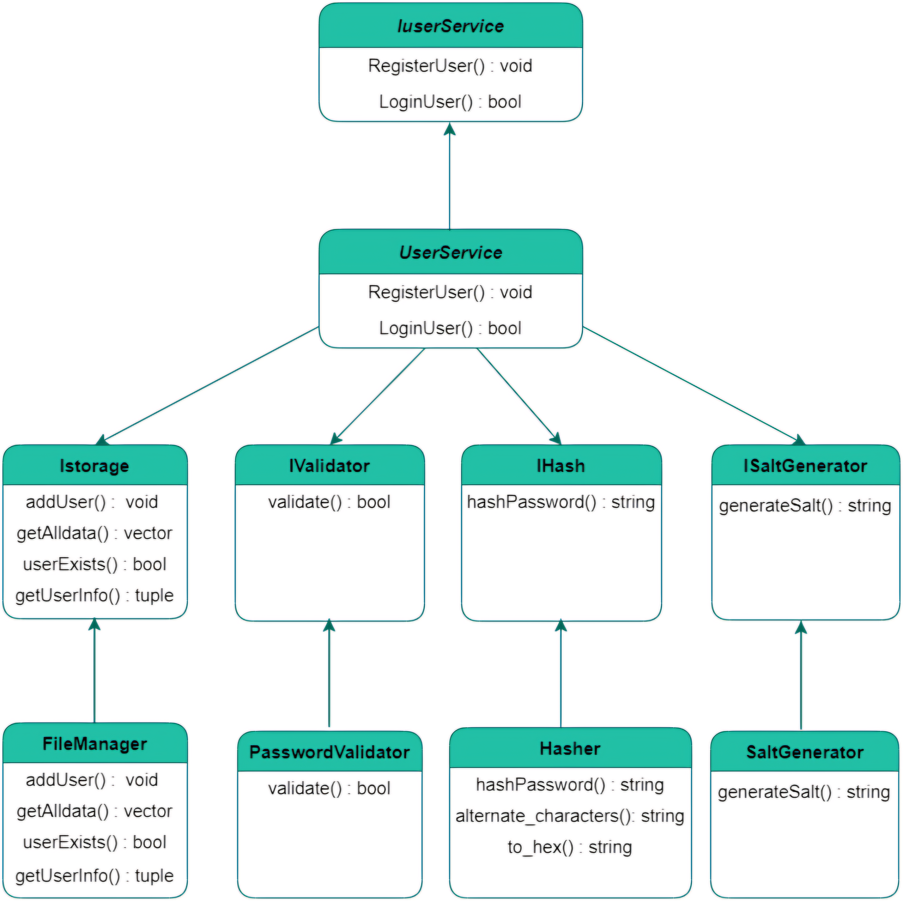

<h1 align="center"><b>Hey </b></h1>

## 📋 Project Description

We are Team 1 in the C++ Project. Our project focuses on creating a user management system that includes user registration, login, and password management functionalities.

**About Us**  
We are a dedicated team working on a C++ project to build a robust user management system.


<h1 align=center>User Authentication System</h1>

This project is a simple user authentication system implemented in C++. It allows users to register with a username and password, and then log in using their credentials. The system uses file-based storage to persist user data and includes basic password hashing and validation.

## Features
- **User Registration**: Users can register with a unique username and a password that meets specific complexity requirements.
- **User Login**: Registered users can log in using their username and password.
- **Password Hashing**: Passwords are hashed using a custom hashing algorithm combined with a randomly generated salt.
- **Password Validation**: Passwords must meet complexity requirements (minimum length, uppercase, lowercase, digits, and special characters).
- **File-based Storage**: User data is stored in a text file (`dataset.txt`).
## Pattern
<div align="center">
    
</div>

## Classes and Components

### Istorage (Interface)
**Purpose**: Defines the interface for storage operations.

**Methods**:
- `addUser`: Adds a new user to the storage.
- `getdata`: Retrieves all user data from storage.
- `userExists`: Checks if a user exists in the storage.
- `getUserInfo`: Retrieves user information (hashed password and salt) by username.

### FileManager (Class)
**Purpose**: Implements the `Istorage` interface to manage user data in a file.

**Methods**:
- `addUser`: Adds a new user to the file.
- `getdata`: Reads all user data from the file.
- `userExists`: Checks if a user exists in the file.
- `getUserInfo`: Retrieves user information from the file.

### SaltGenerator (Class)
**Purpose**: Generates a random salt for password hashing.

**Methods**:
- `generateSalt`: Generates a random string of specified length.

### IHash (Interface)
**Purpose**: Defines the interface for password hashing.

**Methods**:
- `hashPassword`: Hashes the password.

### Hasher (Class)
**Purpose**: Implements the `IHash` interface to hash passwords using a custom algorithm.

**Methods**:
- `hashPassword`: Hashes the password by alternating characters with the salt and converting the result to a hexadecimal string.

### IValidator (Interface)
**Purpose**: Defines the interface for input validation.

**Methods**:
- `validate`: Validates the input (e.g., password).

### PasswordValidator (Class)
**Purpose**: Implements the `IValidator` interface to validate passwords.

**Methods**:
- `validate`: Ensures the password meets complexity requirements.

### IuserService (Interface)
**Purpose**: Defines the interface for user-related services.

**Methods**:
- `RegisterUser`: Registers a new user.
- `LoginUser`: Logs in an existing user.

### UserService (Class)
**Purpose**: Implements the `IuserService` interface to handle user registration and login.

**Methods**:
- `RegisterUser`: Registers a new user by generating a salt, hashing the password, and storing the user data.
- `LoginUser`: Logs in a user by verifying the username and password.

## Usage

### Compile the Code:
```bash
g++ -o user_auth main.cpp
