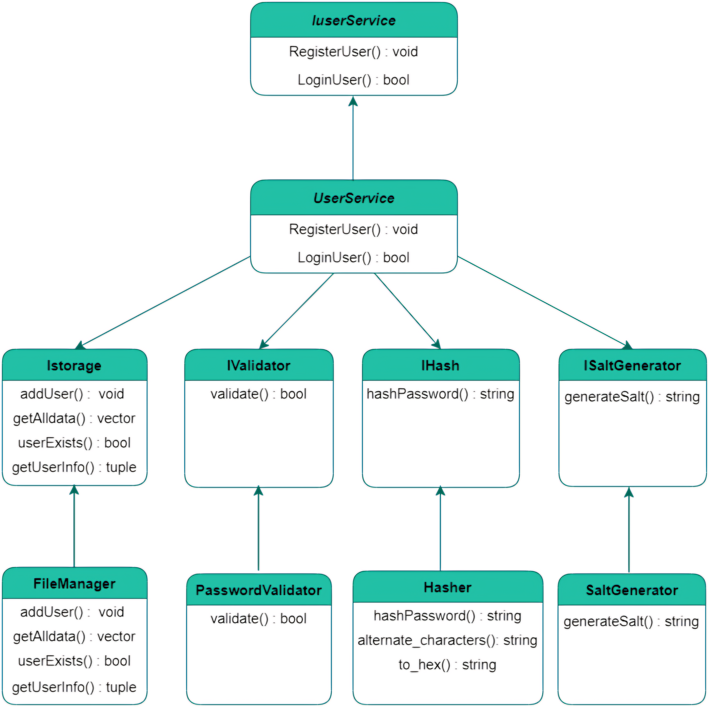

<h1 align="center"><b>Hey </b></h1>

## 📋 Project Description

We are Team 1 in the C++ Project. Our project focuses on creating a user management system that includes user registration, login, and password management functionalities.

**About Us**  
We are a dedicated team working on a C++ project to build a robust user management system.


# <b> Let's Connect..!</b>

[](mailto:hazem.bellili@supcom.tn?subject=Contact%20from%20GitHub)
[](mailto:khalil.gabsi@supcom.tn?subject=Contact%20from%20GitHub)
[](mailto:Majdi.dridi@supcom.tn?subject=Contact%20from%20GitHub)
[](mailto:mouhaned.mouzayen@supcom.tn?subject=Contact%20from%20GitHub)

## 🛠️ Components

### UserService
- **RegisterUser()**: Registers a new user.
- **LoginUser()**: Authenticates a user.

### Istorage
- **addUser()**: Adds a user to the storage.
- **getAlldata()**: Retrieves all user data.
- **userExists()**: Checks if a user exists.
- **getUserInfo()**: Retrieves user information.

### Validator
- **validate()**: Validates user input.

### Hash
- **hashPassword()**: Hashes the password.

### IsaltGenerator
- **generateSalt()**: Generates a salt for password hashing.

### FileManager
- **addUser()**: Adds a user to the file.
- **getAlldata()**: Retrieves all user data from the file.
- **userExists()**: Checks if a user exists in the file.
- **getUserInfo()**: Retrieves user information from the file.

### PasswordValidator
- **validate()**: Validates the password.

### Hasher
- **hashPassword()**: Hashes the password.
- **alternate_characters()**: Alternates characters for hashing.
- **to_hex()**: Converts the hashed password to hexadecimal.

### SaltGenerator
- **generateSalt()**: Generates a salt for password hashing.
" width="300px" align="right" alt="Team Work Animation">
## 🚀 Getting Started

To get started with the project, clone the repository and follow the instructions in the README.

```bash
git clone https://github.com/your-repo.git
cd your-repo
